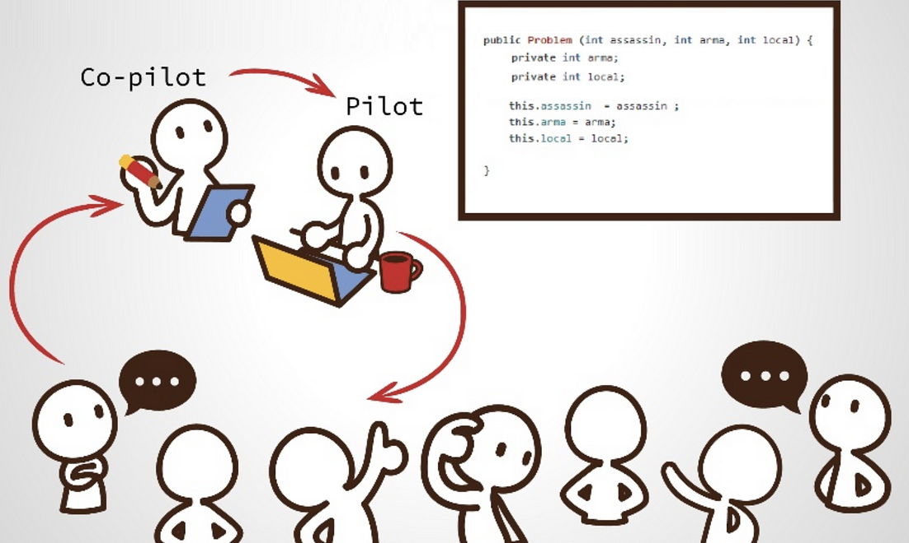

# Coding Dojo snake game
Coding Dojo Snake game using Angular

Main goal of this training is to have fun and share knowledge.

Google can be used at any time.

## Agenda
1. Introduction
2. Work planing
3. Coding
4. Retrospective

## Information About 
### Training

We're going to attempt to build a game called Snake using Angular.

Game should be 100% covered by unit tests.

Tests always run using: `npm run test`.

Code linting ca be check using: `npm run lint`

### Process

## Requirements for snake game

This game need to use canvas element 300x300 for visualisation.

User should be able to see score.

User should be able to collect "apples" in 30 sec of time.

User should be able to control snake using keyboard.

## Game visualisation example

## Extra points
User should be able to set best score
User should be able to update leader board

